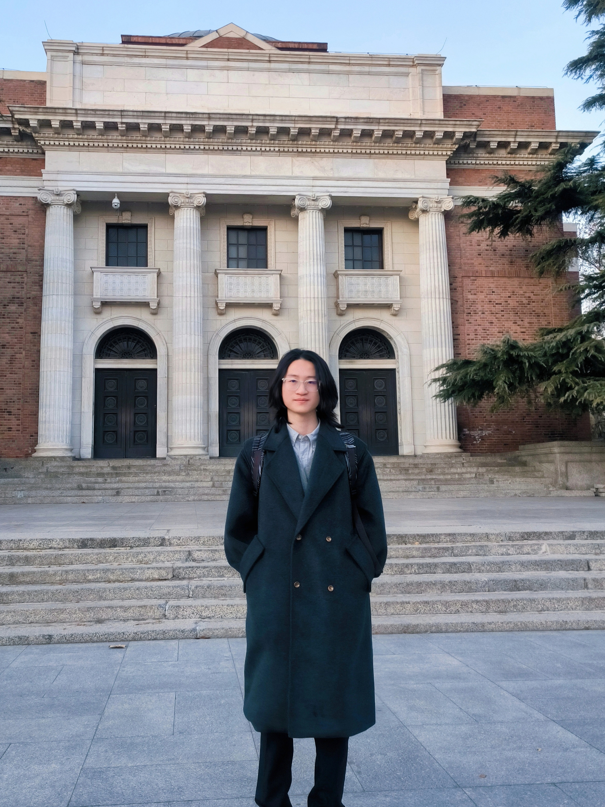

  
  <picture>
    <source srcset="profile.webp">
    
  </picture>
  
  <h1>Hi there, I'm Haopeng Deng👋</h1>

  

    
    
    
  

---

  <ul>
    <li>🎓 I'm an Engineering Management final-year undergrad at Guangzhou Maritime University, incoming Summer Researcher at MIT.</li>
    <li>🔬 Research Interests: Transportation Science & Engineering, AI & Complex Systems, Mixed-Autonomy Traffic Dynamics and Physics-Informed Learning.</li>
    <li>🏆 Proud recipient of the Best Poster Award at the 25th CICTP Conference & Meritorious Winner in ICM 2025.</li>
  </ul>

---
